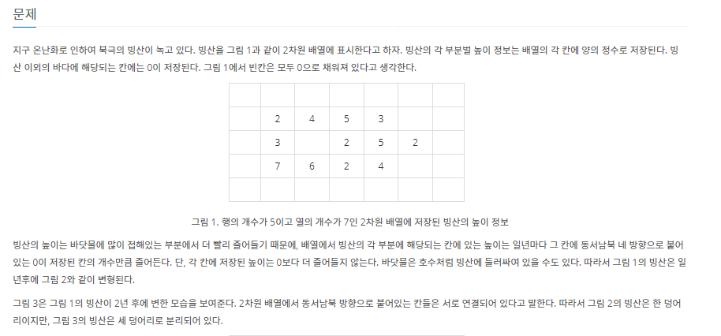
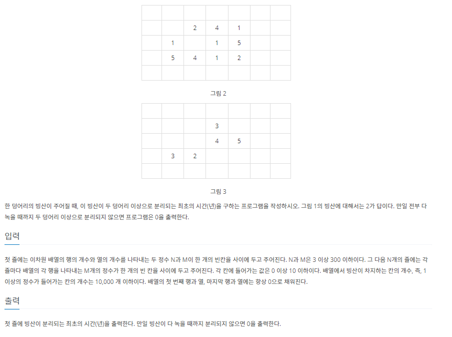

# 7월 9일

## 🚩 빙산

#### ✍ 풀이

- 먼저 빙산 주위의 물의 개수를 구한다.
- 다음으로 `빙산 - 주위 물의 개수`를 한다.
- 그 값이 `0`이 된다면 빙산이 없어진 것이므로 빙산의 무리 개수를 측정한다.
- 무리의 개수가 `2`개 이상이면 `while`문을 빠져나온다.

#### 😒 FAIL 이유

- `water`를 다시 구할 때 초기화를 하지 않았음
- 시간초과...