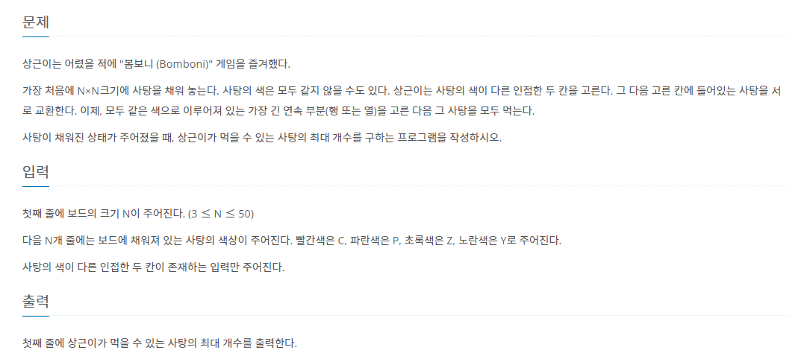
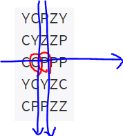
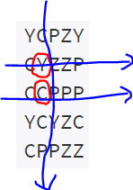
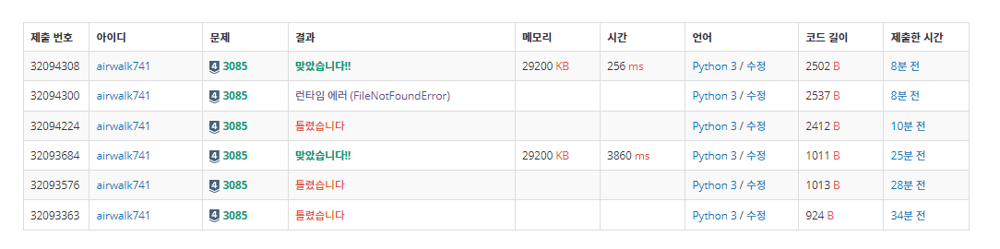

# 8월 11일

## 🚩 사탕게임


[](https://www.acmicpc.net/problem/3085)


#### ✍ 풀이

- 처음 풀이는 바꿀 때마다 모든 행과 열 탐색해서 해결 했었음

  - 시간이 오래 걸렸다.

- 두 번째 풀이는 처음에만 전체를 돌면서 최댓값 구하고 가로로 바꿀 때, 세로로 바꿀 때 따로 구했다.

  - 가로로 바꿀 때 파란색 선만 탐색

  

  - 세로로 바꿀 때 파란색 선만 탐색



#### 처음 코드

```python
import sys
input = sys.stdin.readline

dr = [0, 1]
dc = [1, 0]

def search():
    global result


    for i in range(n):
        cnt_c = 1
        cnt_r = 1
        for j in range(n-1):

            if arr[i][j] == arr[i][j + 1]:
                cnt_c += 1
            else:
                if cnt_c > result:
                    result = cnt_c
                cnt_c = 1

            if arr[j][i] == arr[j + 1][i]:
                cnt_r += 1
            else:
                if cnt_r > result:
                    result = cnt_r
                cnt_r = 1


        result = max(result, cnt_r, cnt_c)


n = int(input())

arr = [list(input().rstrip()) for _ in range(n)]

result = 0


for i in range(n):
    for j in range(n):

        for k in range(2):
            x = dr[k] + i
            y = dc[k] + j

            if -1 < x < n and -1 < y < n:
                arr[i][j], arr[x][y] = arr[x][y], arr[i][j]
                search()
                arr[i][j], arr[x][y] = arr[x][y], arr[i][j]

print(result)

```


#### 결과


