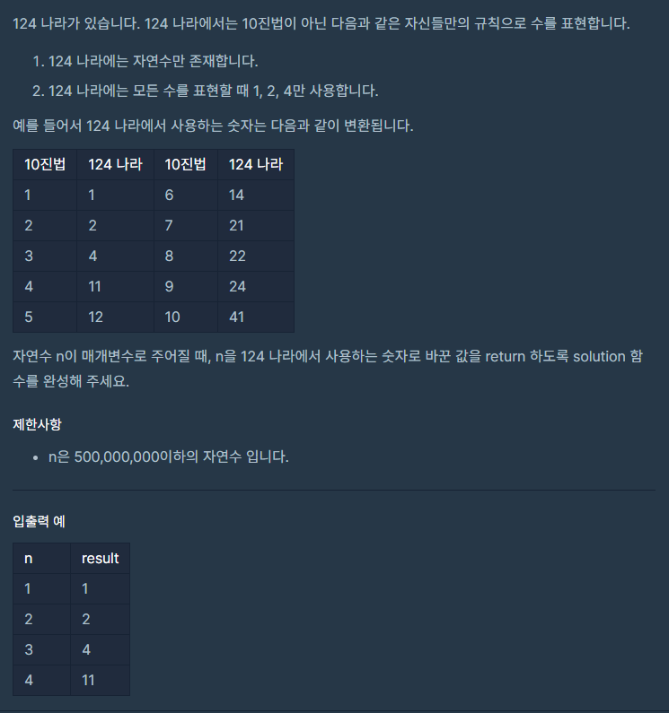

# 8월 14일

## 🚩 124 나라의 숫자




#### 😢 FAIL

- 3진법으로 해결하고자 했다.
- 하지만 4를 어떻게 해결해야할지 도무지 감이 잡히지 않는다.
- 오늘 토스 코테 봤는데 3번 `PASS`는 했지만 아쉬움이 많이 남아서 집중이 안된다.


```python
def solution(n):
    answer = ''
    
    
    if n <= 3:
        num = n % 3
        if num == 0:
            answer += '4'
        else:
            answer += str(num)
    else:
        ## 여기서도 4를 처리해줘야함
    
    return answer
```

