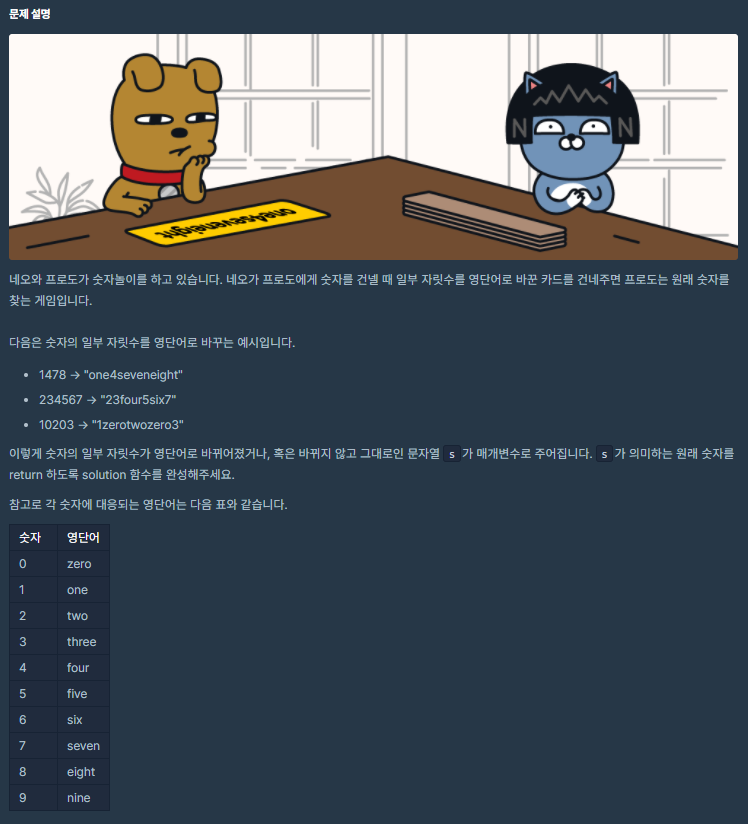

# 8월 16일

## 🚩 숫자 문자열과 영단어

[](https://programmers.co.kr/learn/courses/30/lessons/81301)


#### ✍ 풀이

- 숫자 문자를 리스트로 만든다.
- 리스트 하나씩 꺼내서 대응되는 문자가 `S`에 있다면 숫자로 바꿔준다.
- 없으면 `PASS`


```python
def solution(s):
    answer = 0
    
    num = ['zero', 'one', 'two', 'three', 'four', 'five', 'six', 'seven', 'eight', 'nine']
    
    number = 0
    
    for i in num:
        try:
            s = s.replace(i, str(number))
        except:
            pass
        
        number += 1
    
    return int(s)
```

