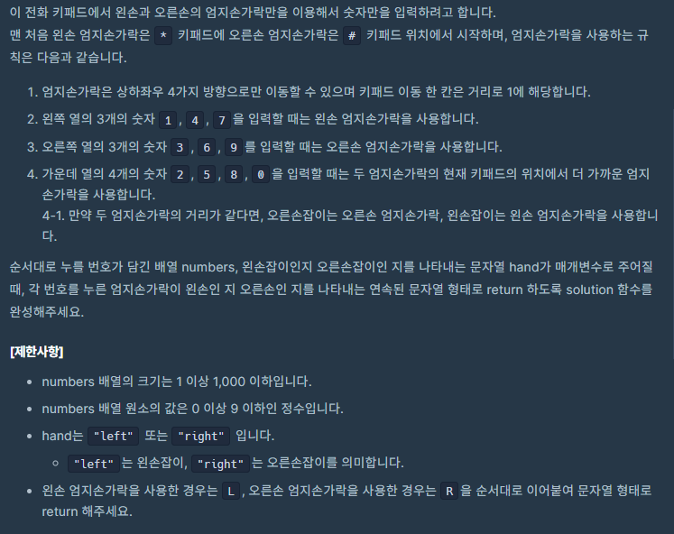

# 8월 18일

## 🚩 키패드 누르기




#### ✍ 풀이

- 먼저 왼손, 오른손만 누를 수 있는 것 체크하기
- 둘 다 누를 수 있으면 피타고라스 이용
- 길이가 같다면 왼손잡이, 오른손 잡이 체크하기


```python
def solution(numbers, hand):
    answer = ''

    phone = {
        '1': (0, 0),
        '2': (0, 1),
        '3': (0, 2),
        '4': (1, 0),
        '5': (1, 1),
        '6': (1, 2),
        '7': (2, 0),
        '8': (2, 1),
        '9': (2, 2),
        '0': (3, 1),
    }
    L = (3, 0)
    R = (3, 2)

    for num in numbers:

        fix = num
        num = phone[str(num)]

        if fix in [1, 4, 7]:
            answer += 'L'
            L = num
        elif fix in [3, 6, 9]:
            answer += 'R'
            R = num
        else:

            L_cnt = (num[0] - L[0]) ** 2 + (num[1] - L[1]) ** 2
            R_cnt = (num[0] - R[0]) ** 2 + (num[1] - R[1]) ** 2

            if L_cnt < R_cnt:
                answer += 'L'
                L = num
            elif L_cnt > R_cnt:
                answer += 'R'
                R = num
            else:
                if hand == 'right':
                    answer += 'R'
                    R = num
                else:
                    answer += 'L'
                    L = num

    return answer
```


