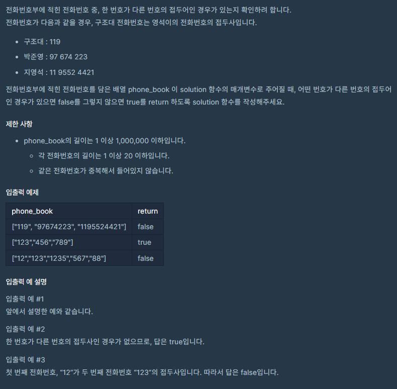
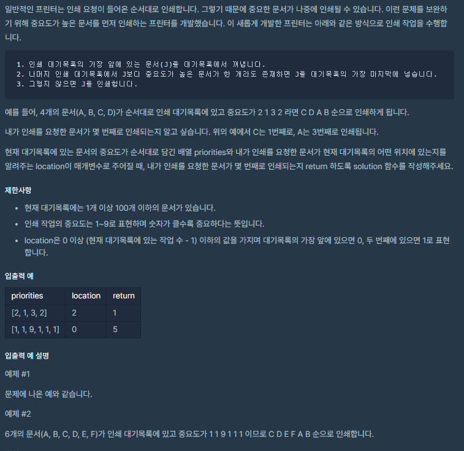

# 8월 2일

## 🚩 전화번호 목록

[](https://programmers.co.kr/learn/courses/30/lessons/42577)


#### 😂 FAIL

- **시간 초과**

  ```python
  from collections import deque
  
  def solution(phone_book):
      answer = True
      
      phone_book = deque(sorted(phone_book)) ## 맨 앞 숫자만 보고 정렬
  
      while phone_book:
          
          num = phone_book.popleft() ## 앞에서 하나 씩 꺼내기
          
          
          for i in range(len(phone_book)): ## 남은 숫자 동안
              
              if num[0] == phone_book[i][0]: ## 접두어기 때문에 맨 앞 글자 다르면 for문 나오기
                  if len(num) > len(phone_book[i]): ## 꺼낸 길이가 더 길면 continue
                      continue
                      
                  for j in range(len(num)): ## 접두어 비교
                      
                      if num[j] != phone_book[i][j]:
                          break
                  else:
                      return False
                
                  # num1 = ''.join(phone_book[i][0:len(num)])
                  # if num == num1:
                  #     return False
                 
              else:
                  break
          
      return answer
  ```

  

## 🚩 프린터

[](https://programmers.co.kr/learn/courses/30/lessons/42587)


#### ✍ 풀이

- 우선 순위 미리 정하기 
- 새로운 배열을 `deque` 써서 만들기
- 새로운 배열 `location` 위치를 `target`으로 설정
- 새로운 배열 하나씩 뽑아서 우선 순위 비교하기
- 비교해서 같다면 꺼내고 아니라면 뒤에 넣기
- 꺼낸 것이 `target`이라면 종료


```python
from collections import deque

def solution(priorities, location):
    answer = 0
    
    newPriorities = sorted(priorities) ## 우선 순위 정렬
    _max = newPriorities.pop() ## 가장 큰 우선 순위
    
    arr = deque(priorities) 
    
    arr[location] = 'target' ## 타겟 지정
    
    
    while arr:
        
        num = arr.popleft() ## 앞에서 하나 뽑기
        
        if num == 'target': ## 그게 타겟이면 우선 순위 비교
            if priorities[location] == _max: ## 가장 큰 우선 순위라면
                answer += 1
                break
            else:
                arr.append(num)
        else:
            if num == _max:
                 _max = newPriorities.pop()
                 answer += 1
            else:
                arr.append(num)
                

    return answer
```


