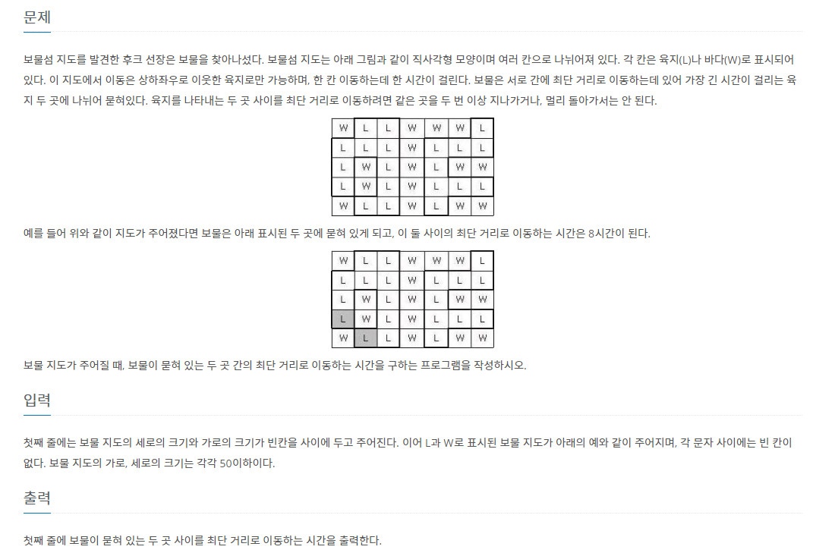
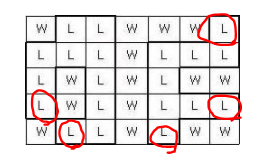
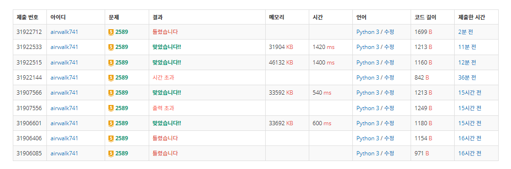

## 8월 6일

## 🚩 보물선




#### ✍ 풀이

- [트리의 지름](https://github.com/airwalk741/Algorithm/tree/master/algorithm/7%EC%9B%94/7%EC%9B%94-19%EC%9D%BC) 처럼 문제를 해결하고자 했다.

- 최대 거리가 갱신 될 때마다 해당 좌표를 리스트에 담는다.

- 담겨진 리스트를 다시 `BFS`로 돌려서 최대 길이를 구했다.


#### 🤔 ??

- 백준에서 `PASS`를 넘겨줬다.
- 내가 처음 생각한 접근이 아니라 코드를 다시 확인했었는데 잘 못 풀었다는 생각이 들었다.

```
5 7
WLLWLLL
LLLWLWL
LWLWLWW
LWLWLLL
WLLWLWL
```

- 아래 테케에서는 `9`를 반환해줘야 할 것 같은데 내 풀이는 `8`을 반환해준다.
- 다시 풀어봐야지...

```py
from collections import deque
import pprint

dr = [-1, 0, 1, 0]
dc = [0, 1, 0, -1]

def bfs(r, c):
    global first_dist
    global first


    q = deque()
    q.append((r, c, 0))


    while q:

        r, c, dist = q.popleft()

        if dist > first_dist:
            first_dist = dist
            first.append((r, c))

        for i in range(4):

            x = r + dr[i]
            y = c + dc[i]

            if -1 < x < n and -1 < y < m:
                if not visited[x][y]:
                    if arr[x][y] == 'L':
                        visited[x][y] = visited[r][c] + 1
                        q.append((x, y, visited[x][y]))


n, m = map(int, input().split())

arr = [list(input()) for _ in range(n)]

first_dist = 0
first = []

visited = [[0] * m for _ in range(n)]

for i in range(n):
    for j in range(m):
        if not visited[i][j]:
            if arr[i][j] == 'L':
                visited[i][j] = 1
                bfs(i, j)

first_dist = 0

second = []
length = len(first)

for i in range(length):

    r, c = first[i][0], first[i][1]
    first_dist = 0
    visited = [[0] * m for _ in range(n)]
    visited[r][c] = 1
    bfs(r, c)
    second.append(first_dist)


print(max(second) - 1)

```


#### ✍ 두 번째 풀이

- 구석 좌표들을 다 구해서 리스트에 담아둔다.
- 구석 좌표들을 하나씩 꺼내서 최대 길이를 구한다.
- 구석 좌표 예시




